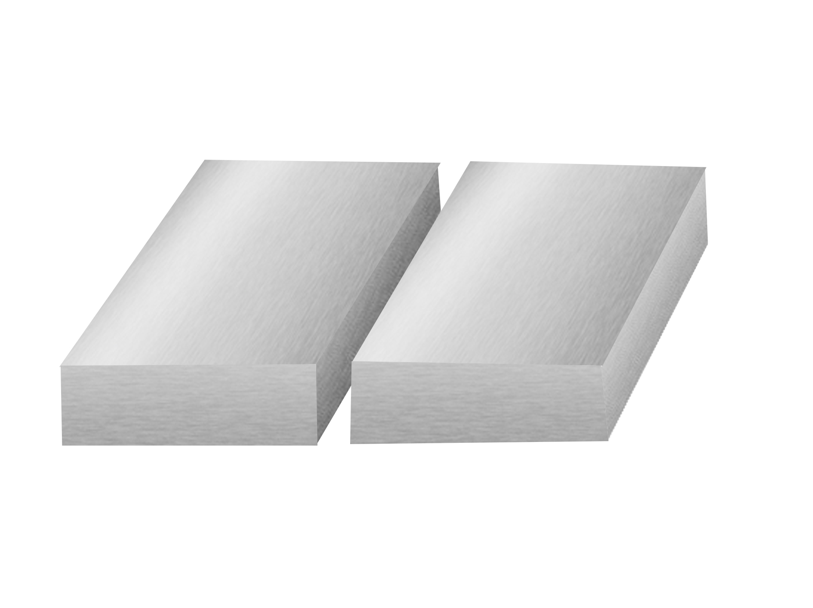
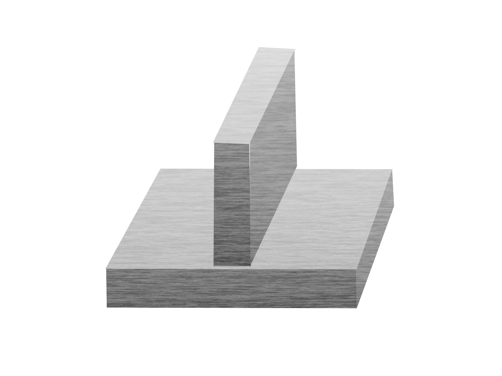

#  Introduction:

To manufacture different material parts into valuable shapes for various functions (industrial, commercial, residential, art, etc.), the parts must be joined. Different joining procedures, such as mechanical fastening, adhesive joining, and welding are used depending on the material and the application. Metals, the most prevalent engineering material, are frequently joined through different welding methods. This experiment will focus on various joint types depending on the design, types of weld bead , and the various welding symbols. These will be helpful in understanding various welding processes. 

***Figure 1: Schematic representation of the welding setup***

 

# Theory:
## Weld joints

Welding is a fabrication process that is used to join diverse materials together such as metals and polymers employing heat, pressure, or both. The pieces that are to be joined are known as workpieces. The workpieces are brought close together to form a coalescence with or without melting the faying surface which leads to the interatomic attraction between the atoms helping them to fuse. A complete and sound weld joint at this interface is known as a weldment.

Understanding of the different types of weld joints is crucial knowledge that a skilled welder should have, as different welding interfaces require different types of welds and joints. According to the American Welding Society (AWS), there are five basic weld joints:
 
- Butt joint 
- Corner joint 
- Lap joint 
- Tee joint and 
- Edge joint 
 
Figure 2 shows the types of the joint design commonly used in welding processes.

***Figure 2: Schematic representation of different types of weld joints***

### Butt joint:

A butt joint is the simplest and most used type of weld joint design in the industry. Two workpieces are placed together along an edge in the same plane and welded, as seen the Figure 2. Butt joints have high strength and are easy to machine and inspect. For plates with larger thicknesses edge preparation  (grooves) is needed. Butt joints are generally used in welding plates, sheet metal, and pipes.

***Figure 3: Schematic representation of the Butt weld joint.***

 

### Corner Joint:
      
A corner joint is made between two workpieces aligned at an approximately right angle forming an “L” shape as illustrated schematically in Figure 3. Fixtures are required for positioning this type of weld. The corner joint is most often found in low load-carrying applications such as the manufacturing of boxes, tanks, box frames, and in sheet metal work. 
 

***Figure 4: Schematic representation of Corner weld joint.***

 

### Lap Joint: 

A lap joint is made when two workpieces are placed overlapping each other as seen in Figure 4. They are one of the strongest joints and can also be used to weld workpieces with different thicknesses. No edge preparation is required, although a bevel may be used to guarantee full root fusion. It is heavily used in automobile assembly applications, and also used when joining thin sheets together.

***Figure 5: Schematic representation of Lap weld joint.***

 

###  Tee joint:

Similar to the corner joints, two workpieces are placed at a right angle, but instead of making an L shape, it makes a T shape. Figure 5 illustrates a common tee joint. Tee joints are made when we need to join workpieces at right angles (such as a tube or pipe to a base plate, or a plate to another plate) T joints are usually prepared without grooves unless the base plate is thick. Welding is generally carried on both sides to improve the load-carrying capacity of the joint. 
 

***Figure 6: Schematic representation of Tee weld joint.***

### Edge joint:

Edge joints are formed by welding the edges of two workpieces together having flanging edges. It may be formed by bending one or both plates at an angle. The edges of the workpieces are parallel or nearly parallel. An example of an edge joint can be seen in figure 6. It is not the strongest of the joints as the weld does not fully penetrate the joint thickness. It is generally used to join sheet metal of less than 0.25-inch thickness that is not subjected to heavy load.

***Figure 7: Schematic representation of Edge weld joint.***

## Types of weld:

Mainly three different types of welding are used i.e. fillet weld, groove weld and surface weld.

### Fillet Weld: 

Fillet weld joins two surfaces at the right angle to each other. It is triangular in shape which can be a convex, concave, or flat surface, and is generally used in the Tee joint, corner joint, and lap joint as illustrated in figure 8. Fillet welds are inexpensive and easy to prepare as edge preparation is generally not required. 

***Figure 8: Schematic representation of various fillet weld joints***

 

### Groove weld:

Groove weld as the name suggests refers to the weld deposited in grooves between two workpieces. The edge is prepared for one or more workpieces to allow access throughout the cross-section, during the welding of thick plates. The grooves can be made with different types of designs i.e., V groove, J groove, bevel,and U groove. Groove design changes depend upon whether full or partial penetration is required as illustrated in figure 9.

After the fillet weld, they are the 2nd most popular weld choice. It is used in various joints of various types of groove welds determined by the edge preparation can be seen below. The most economical is the square groove welds.  

***Figure 9: Schematic representation of various Groove weld joints***

 

### Surface weld:

The deposition of metal on the surface of the workpiece with the help of welding processes is called surface welding. This is also termed as bead on plate and is illustrated in figure 10. It is an economical way of extending and conserving the life of tools and machines. Different chemical or mechanical properties can be achieved for the surface with a surface weld.  

***Figure 10: Schematic representation of Surface Weld***

 

## Welding Positions:

Depending on the application of the parts, welding needs to be performed in various positions. Not all welding processes are capable of welding in all positions and weld parameters also need to be modified to weld in different positions. For example, welding in an overhead position may be needed in structural applications. Welders are expected to practice welding in any position. Some welding jobs can be done in any position while some are limited to just one or two.

American Welding Society has broadly categorized welding positions into major four as can be seen schematically in figure 11:

- **Flat position:** This is the weld position, where the workpieces are kept flat. It is denoted by the symbol 1G or 2F which stands for groove weld and fillet weld respectively. 

- **Horizontal position:** The welding is done in the horizontal direction e.g. 2G or 2F  

- **Vertical position:** The welding is performed vertically upward and vertically downwards. e.g. 3G or 3F 

- **Overhead position:** This welding is the most difficult for the welder to perform as one has to weld overhead against gravity. e.g. 4G or 4F

The difficulty level for the welding increases from Flat to horizontal to vertical to overhead position.

***Figure 11: Schematic of the welding positions (rows) with respect to joint types (column)***

## Welding Symbol & Nomenclature:

Welding is the most frequently used joining process across various industries. Welding can be performed in multiple combinations of positions, welding types, and welding dimensions. Hence, welding symbols identify the exact welding uniquely and for communication purposes. A skilled welder should know these symbols and quickly decipher what type of joint, position, and dimensions of the weld is needed for the job.

The primary welding symbol comprises of the following: 
 
1. **Reference line:** This is the horizontally oriented line which is essential for the welding symbol all the vital information about the weld is drawn on or around it.

2. **Arrow:** The arrow is also an essential element of the weld symbol and is drawn before the reference line.  Arrow indicates, where the weld is to be made. The “arrow side” and “other side” are represented below (near the readers when viewing from the bottom) and above (away from the reader when viewing from the bottom) the reference line respectively. 

Symbols are placed on either side giving out information of the respective sides.

3. **Tail:** Tail provides supplementary information about the weld such as welding specifications, process, etc. The tail may be omitted if there are no specifications. 
     
4. **Dimensions and other data:** Dimensions of a weld are an essential specification for some welds. AWS and ISO both have different ways of designating the weld dimensions.
 
5. **Finish symbols:** The finish symbol dictates how the weld should be shaped or ground after completing the weld. 

6. **Specification, process, or other references:** There are specific symbols for representing different types of process parameters and process specifications.

Figure 12 illustrates the welding symbol with the different elements that helps in representing the weld to be made. 

***Figure 12: Representation of the weld symbols and the basic elements***

 
 
The basic representation of the welding symbol for different grove joint is shown in figure 13.   

***Figure 13: Schematic representation of various groove weld types and its symbols.***

 
 
The basic weld symbols consist of the type of weld, the contour of the weld (convex , concave and flat) , and the type of finish (grinding, michining or chipping). Figure 14 illustrates some of the elements of the basic welding processes.
 

***Figure 14: The above figure represents the Basic weld symbols***

 
 

